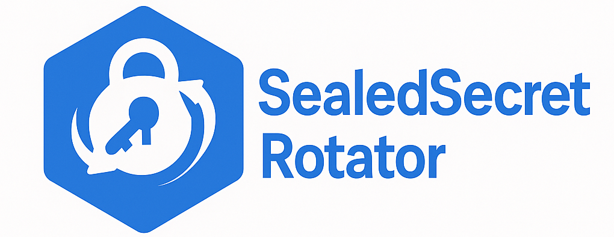
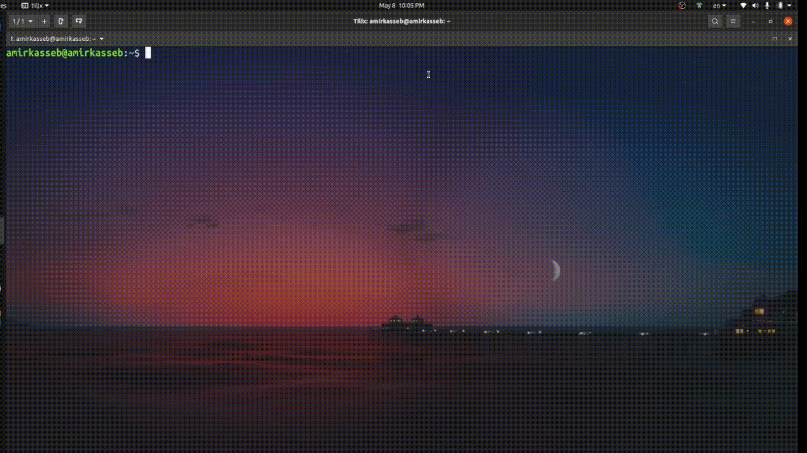
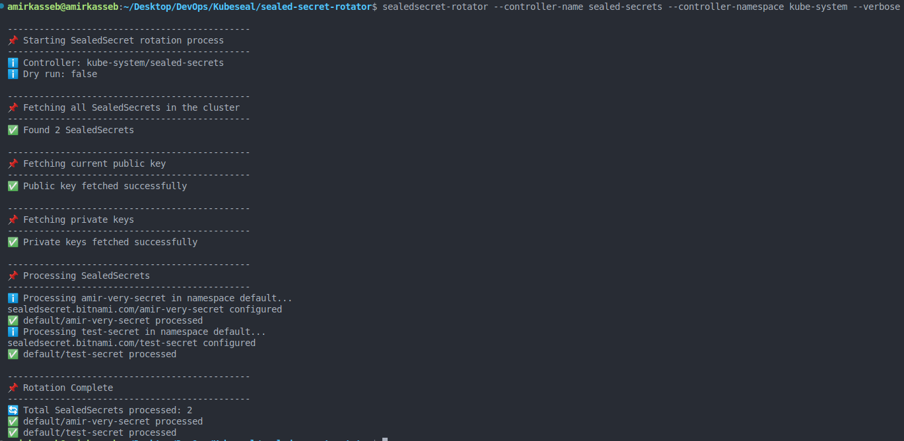

# SealedSecret Rotator

A command-line tool to automate the re-encryption of Kubernetes SealedSecrets after key rotation, built as an extension to the Bitnami `kubeseal` CLI. This project was developed as part of the Instabug Infrastructure Internship Task 2025.

## Overview

The SealedSecret Rotator automates the process of re-encrypting SealedSecret objects in a Kubernetes cluster, addressing the manual effort required after the default 30-day key rotation of the Bitnami SealedSecrets controller. It ensures secrets remain secure and accessible to applications while supporting scalability, security, and logging enhancements.

> 💡 **Important:**  
> You'll find a step-by-step **plan of action** for using the SealedSecret Rotator **at the end of this README**. It's designed to provide deeper context *after* you're familiar with its usage and how it works.

## Table of Contents
- [Features](#features)
- [Project Structure](#project-structure)
- [Background](#background)
- [Installation](#installation)
- [Usage](#usage)
  - [Command](#command)
  - [Flags](#flags)
  - [Example](#example)
- [Implementation Details](#implementation-details)
  - [Key Functions](#key-functions)
- [Future Improvements](#future-improvements)
- [Challenges and Mitigations](#challenges-and-mitigations)
- [Plan of Action](#plan-of-action)
  - [Identifying SealedSecrets](#identifying-sealedsecrets)
  - [Fetching Public Keys](#fetching-public-keys)
  - [Accessing Private Keys](#accessing-private-keys)
  - [Decrypting SealedSecrets](#decrypting-sealedsecrets)
  - [Re-encrypting Secrets](#re-encrypting-secrets)
  - [Updating SealedSecrets](#updating-sealedsecrets)
  - [Logging and Reporting (Bonus)](#logging-and-reporting-bonus)
  - [Scalability for Large Clusters (Bonus)](#scalability-for-large-clusters-bonus)
  - [Security Considerations (Bonus)](#security-considerations-bonus)
- [Contributing](#contributing)
- [License](#license)

## Features

- Automates re-encryption of all SealedSecrets in a Kubernetes cluster.
- Supports dry-run and verbose modes for testing and debugging.
- Integrates with existing `kubeseal` CLI workflows.
- Planned enhancements for JSON logging, concurrency, and secure key handling.


## Background

Bitnami's SealedSecrets controller encrypts Kubernetes secrets using a public key, creating SealedSecret objects that can be safely stored in version control. The controller decrypts these objects within the cluster using a private key. By default, keys rotate every 30 days, requiring manual re-encryption of existing SealedSecrets. The SealedSecret Rotator automates this process, ensuring security and efficiency.


## Project Structure

```plaintext
.
├── assets/
│   └── tool-output.png
├── cmd/
│   └── sealed-secrets-rotator.go
├── go.mod
├── go.sum
├── Makefile
└── README.md
```

This is the directory structure of the SealedSecret Rotator project:

- `assets/`: Contains project assets such as images or other non-code files.
- `cmd/`: Contains the main entry point for the application.
    - `sealed-secrets-rotator.go`: The Go file that contains the logic for the SealedSecret Rotator.
- `go.mod`: Go module file that defines the module and its dependencies.
- `go.sum`: Contains cryptographic checksums for dependencies to ensure their integrity and authenticity in a Go project.
- `Makefile`: A file with commands to build, clean, and install the project. 
- `README.md`: The markdown file that provides an overview of the project and how to use it.


## Installation

To install the SealedSecret Rotator, follow these steps:

1.  **Prerequisites**:
    * Go (version 1.16 or later)
    * `kubectl` configured with cluster access
    * `kubeseal` CLI installed

2.  **Clone the Repository**:
    ```bash
    git clone https://github.com/amirkasseb/sealed-secret-rotator.git
    cd sealed-secret-rotator
    ```

3.  **Install to /usr/local/bin**:
    ```bash
    make install
    ```

4.  **Verify Installation**:
    ```bash
    sealedsecret-rotator --help
    ```

## Usage

Run the tool via the command line with configurable flags.

### Command
```bash
sealed-secret-rotator [flags]
```

### Flags
- `--controller-name <name>`: Name of the SealedSecrets controller (default: `sealed-secrets`).
- `--controller-namespace <namespace>`: Namespace of the controller (default: `kube-system`).
- `--dry-run`: Simulates rotation without applying changes (default: `false`).
- `--verbose`: Enables detailed output (default: `false`).

### Example

- Basic Usage

```bash
sealedsecret-rotator
```



- Verbose Usage

```bash
sealedsecret-rotator --controller-name sealed-secrets --controller-namespace kube-system --verbose
```



This processes all SealedSecrets in the cluster with verbose output.


### Key Functions
- **`getSealedSecrets()`**: Lists all SealedSecrets.
  ```go
  func getSealedSecrets() ([]SealedSecret, error) {
      cmd := exec.Command("kubectl", "get", "SealedSecret", "-A", "-o", "json")
      var out bytes.Buffer
      cmd.Stdout = &out
      if err := cmd.Run(); err != nil {
          return nil, err
      }
      var result struct {
          Items []SealedSecret `json:"items"`
      }
      if err := json.Unmarshal(out.Bytes(), &result); err != nil {
          return nil, err
      }
      return result.Items, nil
  }
  ```

- **`fetchPublicKey()`**: Retrieves the latest public key.
  ```go
  func fetchPublicKey(controllerName, controllerNamespace string) (string, error) {
      cmd := exec.Command("kubeseal", "--fetch-cert",
          "--controller-name", controllerName,
          "--controller-namespace", controllerNamespace)
      var out bytes.Buffer
      cmd.Stdout = &out
      if err := cmd.Run(); err != nil {
          return "", err
      }
      return out.String(), nil
  }
  ```

- **`getPrivateKeys()`**: Fetches private keys.
  ```go
  func getPrivateKeys(namespace string) (string, error) {
      cmd := exec.Command("kubectl", "get", "secret", "-n", namespace,
          "-l", "sealedsecrets.bitnami.com/sealed-secrets-key", "-o", "yaml")
      var out bytes.Buffer
      cmd.Stdout = &out
      if err := cmd.Run(); err != nil {
          return "", err
      }
      return out.String(), nil
  }
  ```

- **`rotateSecret()`**: Decrypts and re-encrypts a SealedSecret.
  ```go
  func rotateSecret(name, namespace, publicKey, privateKeys, controllerName, controllerNamespace string) error {
      getCmd := exec.Command("kubectl", "get", "SealedSecret", name, "-n", namespace, "-o", "json")
      var getOut bytes.Buffer
      getCmd.Stdout = &getOut
      if err := getCmd.Run(); err != nil {
          return err
      }
      publicKeyFile, err := os.CreateTemp("", "public-key-*.pem")
      if err != nil {
          return err
      }
      defer os.Remove(publicKeyFile.Name())
      publicKeyFile.WriteString(publicKey)
      publicKeyFile.Close()
      privateKeysFile, err := os.CreateTemp("", "private-keys-*.yaml")
      if err != nil {
          return err
      }
      defer os.Remove(privateKeysFile.Name())
      privateKeysFile.WriteString(privateKeys)
      privateKeysFile.Close()
      sealCmd := exec.Command("sh", "-c",
          fmt.Sprintf("kubeseal --recovery-unseal --recovery-private-key %s | "+
              "kubeseal --format=yaml --cert=%s --controller-name=%s --controller-namespace=%s | "+
              "kubectl apply -f -",
              privateKeysFile.Name(), publicKeyFile.Name(), controllerName, controllerNamespace))
      sealCmd.Stdin = strings.NewReader(getOut.String())
      sealCmd.Stdout = os.Stdout
      sealCmd.Stderr = os.Stderr
      return sealCmd.Run()
  }
  ```

## Future Improvements

Planned enhancements for the next version include:

- **JSON Logging**: Structured logging for ELK/EFK, writing to `/var/log/sealedsecret-rotator.log` and stdout , So It can be integrated with ELK , EFK Stack and for CI/CD Pipelines. 

  ```json
  {
    "timestamp": "2025-05-08T12:00:00Z",
    "level": "INFO",
    "message": "Processing SealedSecret",
    "namespace": "default",
    "name": "db-secret"
  }
  ```

- **Concurrency**: Worker pool (5-10 workers) for parallel processing.
  ```go
  func processSecrets(secrets []SealedSecret, publicKey, privateKeys string, cfg Config) {
      workerPool := make(chan struct{}, 10)
      for _, secret := range secrets {
          workerPool <- struct{}{}
          go func(s SealedSecret) {
              defer func() { <-workerPool }()
              rotateSecret(s.Metadata.Name, s.Metadata.Namespace, publicKey, privateKeys, cfg.ControllerName, cfg.ControllerNamespace)
          }(secret)
      }
  }
  ```

- **Batch Processing**: Group SealedSecrets for optimized API calls.
- **Checkpointing**: Save progress for crash recovery.
  ```go
  func saveCheckpoint(secret SealedSecret) error {
      data, _ := json.Marshal(secret)
      return os.WriteFile("checkpoint.json", data, 0600)
  }
  ```

- **Rate Limiting**: Prevent API throttling.
  ```go
  func rateLimitedExec(cmd *exec.Cmd, limiter *rate.Limiter) error {
      limiter.Wait(context.Background())
      return cmd.Run()
  }
  ```

- **Enhanced Security**: In-memory key storage or `0600` permissions.
  ```go
  func secureKeyHandling(key string) (*bytes.Buffer, error) {
      buffer := bytes.NewBufferString(key)
      return buffer, nil
  }
  ```

## Challenges and Mitigations

- **API Throttling**: Mitigate with rate limiting and batch processing.
- **Key Security**: Use in-memory storage or secure file permissions.
- **Large Clusters**: Handle scale with concurrency and checkpointing.
- **Error Handling**: Implement robust logging and retry mechanisms.

## Plan of Action

The SealedSecret Rotator extends the `kubeseal` CLI to automate re-encryption. The following steps detail the implementation, supported by the code above:

### Identifying SealedSecrets
- Use the Kubernetes API to list all SealedSecret objects across all namespaces.
- Execute `kubectl get SealedSecret -A -o json` to retrieve metadata (name, namespace).
- Store results in memory for processing (see `getSealedSecrets()`).

### Fetching Public Keys
- Retrieve the latest public key using `kubeseal --fetch-cert`.
- Specify controller name and namespace for accurate key retrieval.
- Cache the key for re-encryption tasks (see `fetchPublicKey()`).

### Accessing Private Keys
- Query secrets labeled `sealedsecrets.bitnami.com/sealed-secrets-key` in the controller's namespace.
- Use `kubectl get secret -n <namespace> -l <label> -o yaml` to fetch private keys.
- Securely handle keys in memory to avoid exposure (see `getPrivateKeys()`).

### Decrypting SealedSecrets
- For each SealedSecret, use `kubeseal --recovery-unseal` with the corresponding private key.
- Process the JSON output to extract the decrypted secret data (see `rotateSecret()`).

### Re-encrypting Secrets
- Use the latest public key to re-encrypt the decrypted secrets via `kubeseal --format=yaml --cert=<public-key>`.
- Generate new SealedSecret objects with updated encrypted data (see `rotateSecret()`).

### Updating SealedSecrets
- Apply the re-encrypted SealedSecret objects using `kubectl apply -f -`.
- Ensure metadata (name, namespace) remains unchanged to avoid disrupting applications (see `rotateSecret()`).

### Logging and Reporting (Bonus)
- Implement JSON-structured logging compatible with ELK/EFK stacks.
- Log to `/var/log/sealedsecret-rotator.log` and stdout.
- Capture events (e.g., start, success, errors) with timestamps, namespaces, and secret names (see planned logging improvement).

### Scalability for Large Clusters (Bonus)
- Implement a worker pool (5-10 workers) for concurrent processing of SealedSecrets (see concurrency improvement).
- Use checkpointing to save progress and enable crash recovery (see checkpointing improvement).
- Apply rate limiting to prevent Kubernetes API throttling (see rate limiting improvement).

### Security Considerations (Bonus)
- Avoid temporary files for keys; use in-memory storage (see security improvement).
- If files are necessary, enforce strict permissions (e.g., `0600`).
- Validate controller identity to prevent key misuse.

## Contributing

Contributions are welcome! Please follow these steps:
1. Fork the repository.
2. Create a feature branch (`git checkout -b feature/new-feature`).
3. Commit your changes (`git commit -m 'Add new feature'`).
4. Push to the branch (`git push origin feature/new-feature`).
5. Open a pull request.

## License

Distributed under the MIT License. See `LICENSE` for more information.